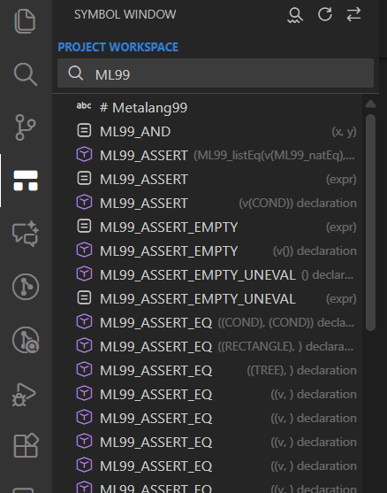
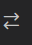

# Symbol Window
this is a mod version with more features than the original.
credits to the original code by - ytlee:
https://marketplace.visualstudio.com/items?itemName=ytlee.symbol-relation-window

A Visual Studio Code extension that provides a "Source Insight"-like symbol navigation experience. It offers a dedicated side panel to browse symbols in the current document or search across the entire workspace with a native look and feel.

## Features

### 1. Current Document Mode
- **Tree View**: Displays symbols (functions, classes, variables, etc.) of the active file in a hierarchical tree.
- **Auto-Sync**: Automatically updates when you switch tabs.
- **Real-time Filtering**: Type in the search bar to instantly filter the symbol tree.
- **Jump to Definition**: Double-click a symbol to jump to its location in the editor.

### 2. Project Workspace Mode
- **Global Search**: Search for symbols across the entire workspace.
- **Multi-keyword Support**: Supports space-separated keywords (e.g., `user controller` matches `UserController`).
- **Performance**: Optimized with debouncing and caching for large projects.
- **Infinite Scroll**: Automatically loads more results as you scroll.
- **Deep Search**: A powerful hybrid search mode that combines text scanning (Ripgrep) with symbol parsing (LSP) to find results in large projects where standard LSP searches might be truncated.
    - **Advanced Filtering**:
        - **Search Scope**: Limit the search to a specific folder.
        - **Files to Include**: Filter results using glob patterns (e.g., `src/**/*.ts`).
    - **Optimized Matching**: Uses regex permutations for fast multi-keyword matching.

### 3. Database Mode (New!)
For large workspaces where standard LSP search is slow or incomplete, Symbol Window now offers a high-performance **Database Mode**.
- **SQLite Backend**: Indexes workspace symbols into a local SQLite database for instant search results.
- **Persistent Index**: The index persists across sessions, so you don't have to wait for re-indexing every time you open VS Code.
- **Incremental Updates**: Automatically detects file changes and updates the index in the background.
- **Hybrid Search**: Combines the speed of database lookups with the accuracy of LSP symbol parsing.
- **Visual Indicator**: The UI clearly labels this mode as **PROJECT WORKSPACE (DATABASE)**.

### 4. Native Experience
- **UI**: Built with `@vscode/webview-ui-toolkit` to match VS Code's native design.
- **Icons**: Uses standard VS Code Codicons.
- **Theme Aware**: Automatically adapts to Light, Dark, and High Contrast themes.

## Configuration

You can customize the appearance and behavior of the symbol list via VS Code settings:

- **`symbolWindow.enable`** (Default: `true`):
  Enable or disable the Symbol Window view.

- **`relationWindow.enable`** (Default: `true`):
  Enable or disable the Relation Window view.

- **`symbolWindow.cleanCStyleTypes`** (Default: `true`):  
  Moves C-style type suffixes (e.g., `(typedef)`, `(struct)`) from the symbol name to the detail view (gray text).
  
- **`symbolWindow.moveSignatureToDetail`** (Default: `true`):  
  Moves function signatures/parameters (e.g., `(int a, char b)`) from the symbol name to the detail view.

- **`symbolWindow.enableDeepSearch`** (Default: `true`):  
  Enables the "Deep Search" feature in Project Mode. This feature uses `ripgrep` to scan files when standard symbol search is insufficient.

- **`symbolWindow.enableDatabaseMode`** (Default: `true`):  
  Enables the high-performance SQLite-based indexing mode. Recommended for large projects.

- **`symbolWindow.indexingBatchSize`** (Default: `15`):  
  Controls how many files are processed in each indexing batch. Max is 200. Default is 15. Lower values reduce UI lag during indexing; higher values speed up indexing but may affect responsiveness.

- **`symbolWindow.includeFiles`** (Default: `""`):  
  Comma-separated list of glob patterns to include in indexing (e.g. `**/*.c, **/*.h`). If empty, all files are included.

- **`symbolWindow.excludeFiles`** (Default: `**/*.md, **/*.txt` + binaries):  
  Comma-separated list of glob patterns to exclude from indexing. These are applied after `.gitignore`.  
  **Default:** `**/*.md, **/*.txt, **/*.log, **/*.lock, **/*.map, **/*.pdf, **/*.doc, **/*.docx, **/*.xls, **/*.xlsx, **/*.ppt, **/*.pptx, **/*.png, **/*.jpg, **/*.jpeg, **/*.gif, **/*.bmp, **/*.ico, **/*.svg, **/*.mp3, **/*.mp4, **/*.wav, **/*.zip, **/*.tar, **/*.gz, **/*.7z, **/*.rar, **/*.bin, **/*.exe, **/*.dll, **/*.so, **/*.dylib, **/*.pdb, **/*.obj, **/*.o, **/*.a, **/*.min.js, **/*.min.css`

## Commands

- **Symbol Window: Refresh**: Reloads symbols for the current view.
- **Symbol Window: Toggle Mode**: Switches between Current Document and Project Workspace modes.
- **Symbol Window: Rebuild Symbol Index (Incremental)**: Triggers a safe, incremental update of the symbol database (Database Mode only).
- **Symbol Window: Rebuild Symbol Index (Full)**: Completely clears the database and re-indexes the entire workspace. Use this if the index appears corrupted.
- **Symbol Window: Focus Search Box**: allow keybinding to show window and also make search text box in focus.

## Usage

1.  **Open the View**:  
Click the "Symbol Window" icon in the Activity Bar (usually on the left).

2.  **Switch Modes**:  
Click the "Toggle Mode" icon in the view title area (top right of the panel) to switch between "Current Document" and "Project Workspace".

3.  **Refresh**:  
Click the "Refresh" icon to reload symbols or clear the search cache.
4.  **Navigate**:
    - **Click**: Select a symbol.
    - **Double-Click**: Jump to the symbol in the editor.
    - **Arrow Keys**: Navigate the list.
    - **Enter**: Jump to the selected symbol.
5.  **Deep Search**: 
    - *Note: This feature is enabled by default via `symbolWindow.enableDeepSearch`.*
    - **Toggle Details**: In **Project Mode**, click the `...` (kebab) icon in the search bar to reveal advanced options.
    - **Scope**: Click the folder icon to select a specific root directory for your search.
    - **Files to Include**: Enter glob patterns (e.g., `*.ts`, `src/**`) to filter the files being searched.
    - **Deep Search**: If standard LSP search is insufficient, the extension automatically leverages `ripgrep` with optimized regex permutations to find symbols across your defined scope.
6.  **Database Mode**:
    - Enable `symbolWindow.enableDatabaseMode` in settings.
    - The view title will change to **PROJECT WORKSPACE (DATABASE)**.
    - The first time you enable it, the extension will index your workspace. Subsequent searches will be instant.

## Requirements

This extension relies on VS Code's built-in symbol providers. You must have a language extension installed for the files you are editing (e.g., C/C++ extension for `.c/.cpp` files, TypeScript extension for `.ts` files).

**Note on Large Projects:**
If you open a large workspace, the extension may show a "Waiting for symbol provider..." status initially. This is normal and indicates that the language server (e.g., C/C++ IntelliSense) is still indexing your files. The view will automatically unlock once the provider is ready.

## Limitations & Enhancements

This extension is built on top of VS Code's native Symbol APIs (`vscode.executeDocumentSymbolProvider` and `vscode.executeWorkspaceSymbolProvider`). While it inherits the underlying capabilities of your installed Language Server Protocol (LSP) extensions, it also provides significant enhancements:

**Enhancements:**
- **Multi-Keyword Search**: Unlike standard VS Code search which often requires exact order, Symbol Window supports space-separated keywords (e.g., `User Controller`) and performs a client-side intersection. This allows for order-independent matching and more precise filtering.
- **Structure Visualization**: Provides a persistent tree view for the current document, unlike the transient "Go to Symbol" quick pick.
- **Database Mode**: Solves the "incomplete results" problem of standard LSP by maintaining a full index of workspace symbols.

**Limitations:**
- **Search Results (Standard Mode)**: The completeness of the *initial* search results depends on the language extension. If the LSP truncates results (e.g., returns only the first 100 matches for "User"), our enhanced filtering can only operate on that subset. **Use Database Mode to overcome this.**
- **Indexing Speed**: The "Readiness" of the symbol window depends on how fast your language extension can index the workspace.

## Future Work

1.  **Relation Window**: A planned feature to visualize call hierarchies and symbol relationships (Callers/Callees) directly within the side panel.

## Known Issues

- **Sync Selection**: Currently, clicking a symbol in the editor does not automatically highlight it in the Symbol Window list (Planned feature).
- **Initial Loading**: For very large workspaces, the "Project Mode" might show "Waiting for symbol provider..." for a few seconds while the language server indexes the project.

## Contributing

See [CONTRIBUTING.md](CONTRIBUTING.md) for instructions on how to build and contribute to the project.

## License

[MIT](LICENSE)
